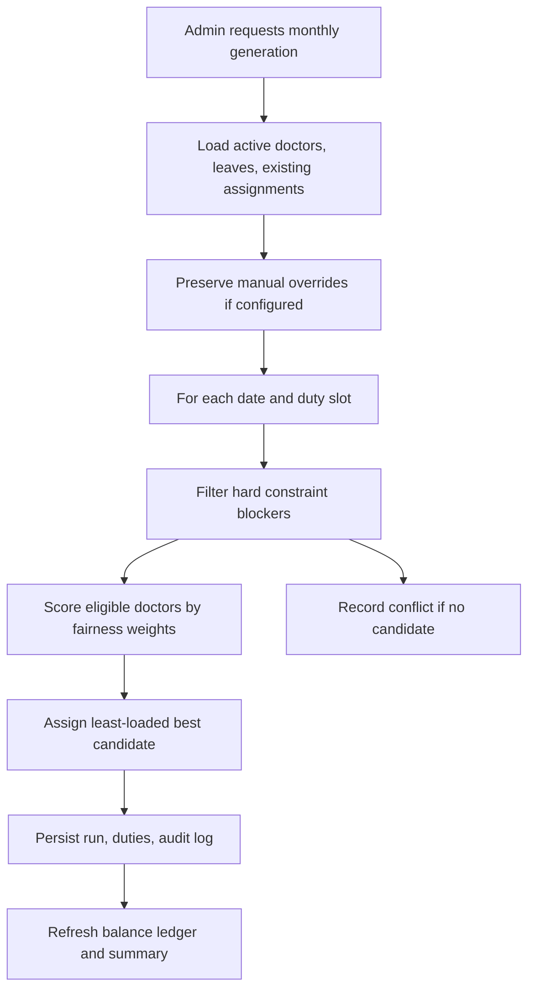

# Architecture

## Backend

FastAPI exposes REST modules under `/api`. SQLAlchemy models are normalized around user accounts, doctor profiles, department assignment, leave requests, duty assignments, roster generation runs, balance ledger rows, notifications, and audit logs.

The backend separates concerns:

- `api/routes`: HTTP routing, permission checks, request/response handling
- `schemas`: Pydantic validation and response contracts
- `models`: database entities and relationships
- `services`: scheduling, analytics, exports, notifications, audit logging
- `core`: settings, CORS, JWT, bcrypt

## Frontend

The React app is an authenticated admin panel:

- Zustand persists the JWT session.
- Axios attaches the Bearer token and handles session expiry.
- FullCalendar powers leave and roster calendars.
- Recharts renders duty mix, workload, fairness, and balance charts.
- shadcn-style local components provide consistent accessible controls.

## Scheduling Flow

## Security

- Passwords are hashed with bcrypt through Passlib.
- JWTs include user subject and role.
- Role dependencies protect privileged endpoints.
- SQLAlchemy parameterization protects database queries from injection.
- CORS origins are environment-driven.
- Audit logs record sensitive roster, user, doctor, and leave mutations.
